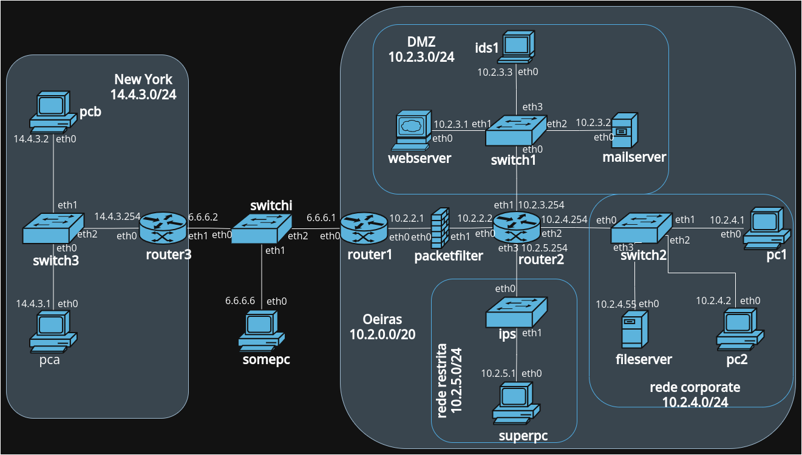

# SIRS-LETI-24-25-Project
Application of several security mechanisms in a network composed by multiple computers, routers and other devices, built using Kathará

  
  

## 🔐 Main Features

### 🌐 Network Emulation
- Full emulation of a corporate network with routers, switches, firewalls, servers, and workstations.
- Segmented into Oeiras, NY and Internet zones.

### 🔒 Security Mechanisms
- **VPN (OpenVPN):** Encrypted tunnel between Oeiras and NY using AES-128-GCM.
- **SSH (OpenSSH):** Remote admin access with public key authentication.
- **Firewall (iptables):** Packet filtering enforcing strict access rules and anti-spoofing.
- **IDS/IPS (Snort):** Intrusion detection and prevention with alerting + blocking (ICMP flood, port scans, etc.).

### 🧪 Testing & Tools
- Services emulated with `netcat` and `Apache2`.
- Testing via `ping`, `tcpdump`, `traceroute`, `nmap`, `curl`, and `nc`.

### 🛠️ Deliverables
- Network diagram with IP mappings.
- Fully configured Kathará lab.
- Security configuration + testing documented in a structured questionnaire.

---

## 📁 Resources
- Open Notes [HERE](https://docs.google.com/document/d/1E7QlaqlgsbNraZMBSjSRi31UOJsMH-_uyKHDtOrJUx8/edit?usp=sharing)
- Open Report [HERE](https://docs.google.com/document/d/1xaYT-1VKpHx1aT-xeMEjktiA_5APsadZX9LC8q0m0eA/edit?usp=sharing)

📌 <b>Subject</b> <i>(Click to show)</i>

 

  

> Built for the SIRS course @ Instituto Superior Técnico, 2024/25.
